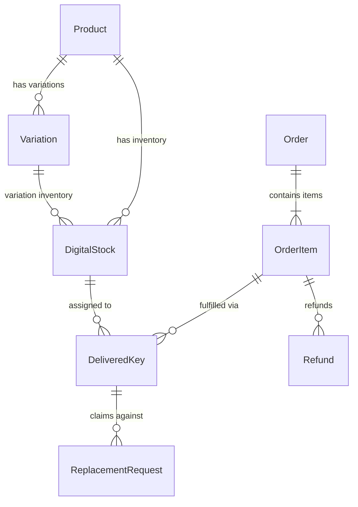

# 02 — Schema Contract & Database Architecture

## Owner: Agent 1 (Domain & Prisma Architecture Owner)

### 1. Prisma Models & Relationships
The central database schema in `prisma/schema.prisma` defines the canonical relationships:

### 2. Field Specifications
* **`Product`**:
  * `productType`: `ProductType` enum (`SUBSCRIPTION`, `LICENSE_KEY`, `ACCOUNT`, `DIGITAL_CREDIT`, `WORKSPACE_ACCESS`, `DOWNLOAD`, `SERVICE`)
  * `fulfillmentType`: `FulfillmentType` enum (`AUTO_STOCK`, `MANUAL`, `PROTECTED_DOWNLOAD`, `WORKSPACE_INVITE`, `EXTERNAL_ACTIVATION`)
  * `warrantyDays`: Int (default 30)
  * `replacementAllowed`: Boolean (default true)
  * `refundAllowed`: Boolean (default true)
  * `specifications`: JSON array of `{ label: string, value: string }`
  * `status`: `ProductStatus` (`DRAFT`, `ACTIVE`, `INACTIVE`, `ARCHIVED`)
  * `visibility`: `ProductVisibility` (`PUBLIC`, `HIDDEN`, `DIRECT_LINK_ONLY`)

* **`Variation`**:
  * `duration`: String? (e.g. `"1 Month"`, `"1 Year"`, `"Lifetime"`)
  * `fulfillmentType`: `FulfillmentType`? (nullable override)
  * `warrantyDays`: Int? (nullable override)
  * `replacementAllowed`: Boolean? (nullable override)
  * `refundAllowed`: Boolean? (nullable override)
  * `inStock`: Boolean (default true)

* **`OrderItem`**:
  * `fulfillmentType`: `FulfillmentType` (snapshot of resolved fulfillment)
  * `warrantyDaysAtPurchase`: Int (default 30)
  * `refundWindowDaysAtPurchase`: Int (default 7)
  * `replacementAllowedAtPurchase`: Boolean (default true)
  * `refundAllowedAtPurchase`: Boolean (default true)

* **`DigitalStock`**:
  * `productId`: String, `variationId`: String?
  * `type`: `StockType` (`LICENSE_KEY`, `ACCOUNT_CREDENTIAL`, `DOWNLOAD_LINK`, `TEXT_INSTRUCTIONS`)
  * `payloadEncrypted`: Text (AES-256-GCM encrypted)
  * `fingerprint`: VarChar(128)? (SHA-256 duplicate prevention index)
  * `status`: `StockStatus` (`AVAILABLE`, `RESERVED`, `DELIVERED`, `INVALID`, `REPLACED`, `REFUNDED`, `EXPIRED`)
  * `assignedOrderId`: String?, `assignedOrderItemId`: String?
  * `expiryDate`: DateTime? (pre-sale supplier expiry)

* **`DeliveredKey`**:
  * `orderId`: String, `orderItemId`: String?
  * `stockId`: String?
  * `credentials`: Text, `credentialsEncrypted`: Text?
  * `warrantyExpiresAt`: DateTime?
  * `isReplacement`: Boolean (default false)
  * `replacedDeliveryId`: String?

---

### 3. Database Constraints & Migration Invariants
1. `Variation.productId` $\rightarrow$ `Product.id` (`onDelete: Cascade`)
2. `OrderItem.orderId` $\rightarrow$ `Order.id` (`onDelete: Cascade`)
3. `DeliveredKey.orderId` $\rightarrow$ `Order.id` (`onDelete: Cascade`)
4. `DeliveredKey.orderItemId` $\rightarrow$ `OrderItem.id` (`onDelete: SetNull`)
5. `DeliveredKey.stockId` $\rightarrow$ `DigitalStock.id` (`onDelete: SetNull`)
6. `DigitalStock.assignedOrderId` $\rightarrow$ `Order.id` (`onDelete: SetNull`)
7. `DigitalStock.assignedOrderItemId` $\rightarrow$ `OrderItem.id` (`onDelete: SetNull`)
8. Indexes on `[productId, variationId, status]`, `[assignedOrderId]`, `[fingerprint]`.
