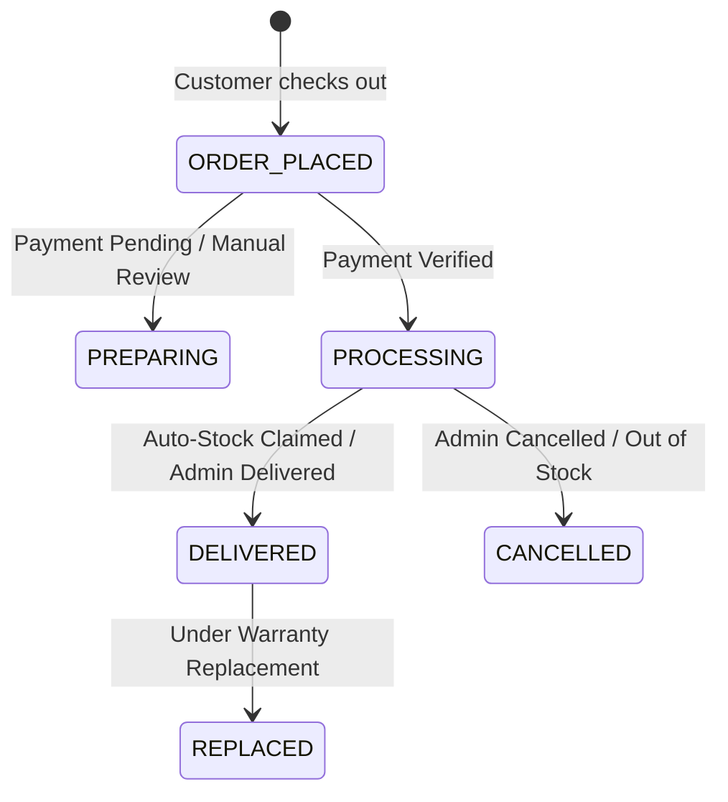

# 04 — Fulfillment & Delivery Architecture Contract

## Owner: Agent 3 (Senior Digital Fulfillment Engineer)

### 1. Core Fulfillment Lifecycle State Machine



---

### 2. Fulfillment Handlers (Lightweight Adapter Architecture)

Each fulfillment mode is processed by a specialized handler conforming to the common contract:

```typescript
export interface FulfillmentContext {
  orderId: string;
  orderNumber: string;
  orderItemId: string;
  productId: string;
  variationId: string | null;
  productName: string;
  variationName: string;
  quantity: number;
  userId: string | null;
  customerEmail: string;
  customerName: string;
  warrantyDays: number;
  durationDays: number | null;
}

export interface FulfillmentResult {
  success: boolean;
  deliveryStatus: "DELIVERED" | "PROCESSING" | "CANCELLED";
  deliveredCount: number;
  deliveredKeys: Array<{
    id: string;
    stockId?: string;
    productName: string;
    credentialsEncrypted: string;
    warrantyExpiresAt?: Date;
  }>;
  errorMessage?: string;
}

export interface IFulfillmentHandler {
  canHandle(fulfillmentType: FulfillmentType): boolean;
  validate(context: FulfillmentContext): Promise<{ valid: boolean; reason?: string }>;
  fulfill(tx: any, context: FulfillmentContext): Promise<FulfillmentResult>;
}
```

### 3. Handler Implementations
* **`StockFulfillmentHandler` (`AUTO_STOCK`)**:
  * Atomically claims available stock from `DigitalStock` table.
  * Creates `DeliveredKey` records.
  * Updates `OrderItem.deliveryStatus = "DELIVERED"`.
* **`ManualFulfillmentHandler` (`MANUAL` / `WORKSPACE_INVITE` / `EXTERNAL_ACTIVATION`)**:
  * Sets `OrderItem.deliveryStatus = "PROCESSING"`.
  * Alerts admin via Telegram queue for manual dispatch.
* **`ProtectedDownloadHandler` (`PROTECTED_DOWNLOAD`)**:
  * Provisions protected download access record into `DeliveredKey` with signed download instructions.

---

### 4. Idempotency & Concurrency Invariants
1. **Never Double-Fulfill**: A handler checks `existingDeliveries = count(DeliveredKey where orderItemId = item.id)`. If `existingDeliveries >= item.quantity`, it immediately returns `{ success: true, deliveredCount: existingDeliveries }`.
2. **Transaction Isolation**: Stock claiming uses conditional atomic update inside Prisma `$transaction` (`updateMany where id = available.id and status = 'AVAILABLE'`). If `count === 0`, concurrent claim collision is detected and another stock item is selected.
