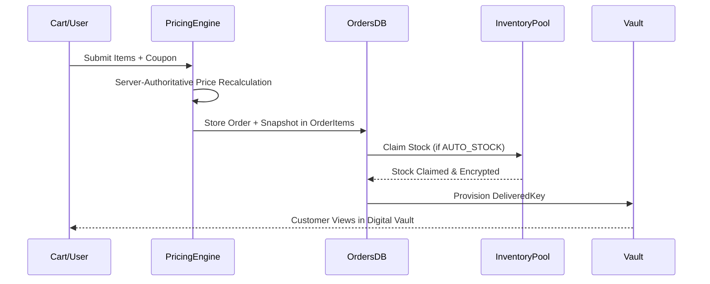

# 05 — Pricing, Order Snapshot & Purchase Contract

## Owners: Agent 4 (Inventory/Entitlement) & Agent 5 (Pricing/Order Snapshot)

### 1. Separation of Inventory vs Entitlement
* **Inventory (`DigitalStock`)**: A pre-existing sellable asset belonging to AI Haat (e.g. unassigned license key).
* **Entitlement / Delivery (`DeliveredKey`)**: The post-purchase record representing what the customer legally owns and can access in their Digital Vault.

---

### 2. Snapshot Invariants in `OrderItem`
When an order is created, the system copies snapshot values into `OrderItem`:
* `priceBDT`: The exact unit price at purchase.
* `warrantyDaysAtPurchase`: Snapshot of warranty policy at purchase.
* `refundWindowDaysAtPurchase`: Snapshot of refund window policy at purchase.
* `replacementAllowedAtPurchase`: Snapshot of replacement policy.
* `refundAllowedAtPurchase`: Snapshot of refund policy.
* `fulfillmentType`: Snapshot of resolved fulfillment method.

### 3. Historical Accuracy Guarantee
* If an admin subsequently raises a product's price from ৳500 to ৳700, past orders retain `priceBDT = 500`.
* If an admin disables a variation or changes warranty from 30 days to 7 days, past orders preserve their purchase-time policy.
* If a product is archived or deleted from catalog view, historical orders, deliveries, and vault records remain intact.
