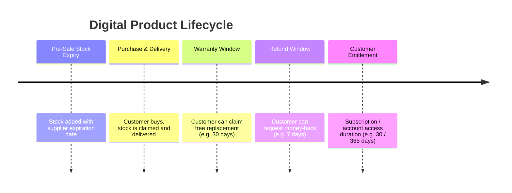

# 06 — Warranty, Expiry, Replacement & Refund Domain Contract

## Owner: Agent 6 (Senior After-Sales Domain Engineer)

### 1. Distinct Lifecycle Concepts

---

### 2. Replacement Rules & Replacement Chain
1. **Eligibility**:
   * Request MUST reference a valid `DeliveredKey` owned by the user.
   * `now <= DeliveredKey.warrantyExpiresAt` (unless admin explicitly overrides).
   * Associated `OrderItem.isRefunded` MUST NOT be true.
   * No active replacement request may already exist for that `DeliveredKey`.
2. **Execution**:
   * Old `DigitalStock` record (if any) is transitioned to status `REPLACED`.
   * New replacement `DigitalStock` is claimed and provisioned as a new `DeliveredKey` with `isReplacement = true` and `replacedDeliveryId = originalDelivery.id`.
   * Replacement preserves original warranty expiration date (`warrantyExpiresAt` remains original duration).

---

### 3. Refund Rules & Historical Financial Truth
1. **Eligibility**:
   * Request window is governed by purchase-time `refundWindowDaysAtPurchase` (default 7 days from purchase/delivery).
   * Item must not be already refunded (`isRefunded === false`).
2. **Refund Calculation**:
   * Pro-rata value calculated using `(item.priceBDT * item.quantity / order.subtotalBDT) * order.totalBDT`.
   * Max refundable amount is capped at `netPaidValue - refundedBDT`.
3. **Execution**:
   * On approval, funds are credited to user's AI Haat Wallet or MFS gateway.
   * `OrderItem.isRefunded` set to `true`, `order.refundedBDT` incremented.
