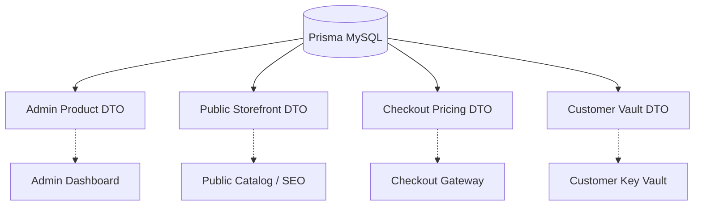

# 07 — API, DTO & Security Contract

## Owners: Agent 7 (Admin UX) & Agent 8 (API & Security)

### 1. DTO Boundaries

### 2. Privacy & Security Invariants
* **`PublicProductDTO`**: Excludes `costPriceBDT`, `payloadEncrypted`, `fingerprint`, `supplierId`, and internal audit notes.
* **`CheckoutProductDTO`**: Excludes internal admin configurations; contains only authoritative IDs, pricing, duration, and availability.
* **`VaultDTO`**: Exposes decrypted credentials ONLY to verified session owners (matching `order.userId` or `order.customerEmail`), protected against IDOR.
* **`AdminProductDTO`**: Full configuration accessible only by users with role `ADMIN` and valid `MfaSession`.

---

### 3. Server-Side Request Validation
All product mutations enforce strict validation:
* `name`: string, min length 2, required.
* `productType`: valid `ProductType` enum.
* `fulfillmentType`: valid `FulfillmentType` enum.
* `minPriceBDT` / `priceBDT`: positive number.
* `salePriceBDT`: if provided, must be `< regularPriceBDT`.
* `variations`: array of valid variations; each active variation must have `priceBDT > 0`.
* `warrantyDays`: integer $\ge 0$.
