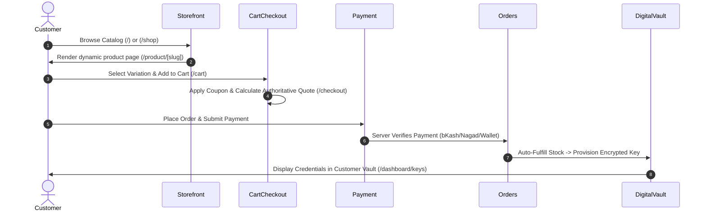

# 05 — E2E Routes & Critical User Journeys

## 1. Customer Golden Path

---

## 2. Admin Operational Journey
1. **Authentication & Step-Up**: Admin logs in, verifies TOTP/Email OTP.
2. **Order Management**: Search orders by order number, customer phone, or status.
3. **Manual Fulfillment**: Assign credentials to manual service orders and notify customer via email.
4. **Wallet Deposits**: Review pending manual deposits (bKash/Nagad TrxID) and approve credit atomically.
5. **Replacements & Refunds**: Review warranty replacement claims and process 1-click replacement delivery or wallet refund.
6. **Support Ticket Handling**: Reply to customer inquiries and add internal staff notes.
