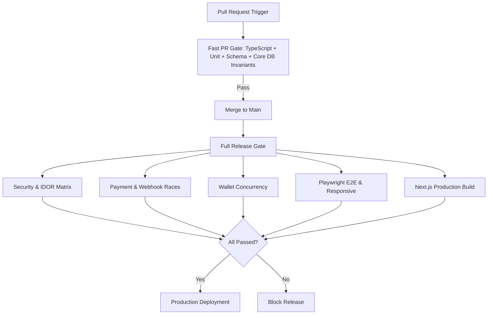

# 07 — Release Gates & Defect Severity Protocol

## 1. Defect Severity Classification

* **P0 — Catastrophic Release Blocker**:
  * Financial leakage (price tampering, wallet double-spend, duplicate webhook credit, refund $> \text{paid}$).
  * Security breach (IDOR, credential leak to unauthenticated/public API, admin auth bypass).
  * Data corruption (stock double-delivery, loss of order historical snapshot).
  * *Policy: ZERO P0 defects allowed for release.*
* **P1 — Critical Workflow Blocker**:
  * Complete checkout blockage on supported payment methods.
  * Auto-delivery completely stalled despite valid inventory.
  * Broken authentication or inaccessible customer vault.
  * *Policy: ZERO P1 defects allowed unless business owner grants signed exemption.*
* **P2 — Major Non-Blocking Issue**:
  * Edge-case UI overflow on unusual screen widths, minor copy inaccuracies, slow analytics dispatch.
  * *Policy: Release permitted with scheduled patch sprint.*
* **P3 — Minor Visual / Non-Critical**:
  * Cosmetic animation glitches, minor spacing issues.

---

## 2. Fast PR Gate vs Full Release Gate

